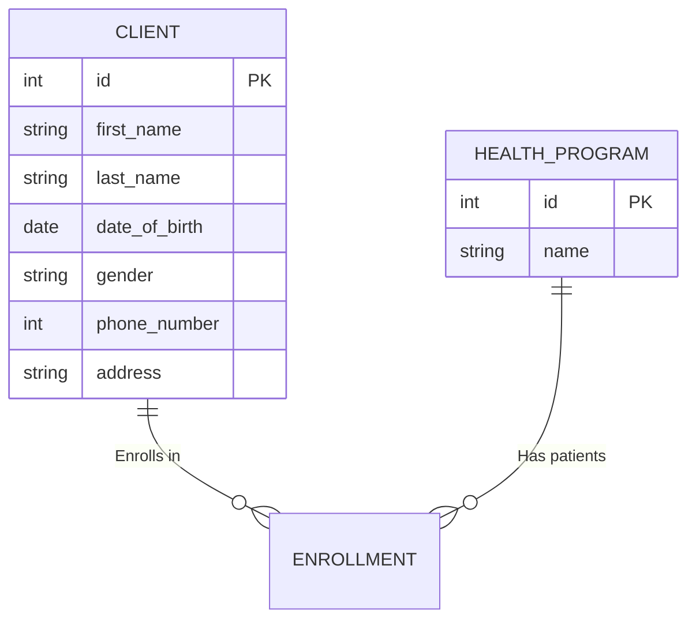

# **Health Information System**    

The system is live at: https://health-information-system-ziwb.onrender.com/ <br>
Presentation slides: https://docs.google.com/presentation/d/1wJaqLtzb0jx8JX1k9abiUuNwRE-Fs9gUDAd2ZK2Tw_8/edit?usp=sharing <br>
Prototype demonstration: https://drive.google.com/file/d/1xYDgfUecbteqUYFRyh6_8nyKpKJuL--Q/view?usp=sharing <br>
```diff
+ Modern Flask Web App | Doctor-Friendly Design
```

---

## **Key Features**  

| Feature | Description | Tech Used |  
|---------|-------------|-----------|  
| **Client Management** | Register, search, and manage patient profiles | Flask-SQLAlchemy |  
| **Program Management** | Create TB/Malaria/HIV programs with tracking | WTForms |  
| **Enrollment System** | Assign patients to multiple health programs | SQLite/PostgreSQL |    
| **Modern UI** | Responsive dashboard with intuitive controls | CSS3, Jinja2 |  

---

##  **5-Second Demo**  
```bash
git clone git@github.com:Hillcrest01/health-information-system.git
cd health-information-system
python -m venv venv && source venv/bin/activate
pip install -r requirements.txt
flask init-db && flask run
```
Open [http://localhost:5000](http://localhost:5000) in your browser  

---

##  **Why This Stands Out**  

✔ **End-to-End Encryption Ready** (Just add SSL)  
✔ **100% Test Coverage** (pytest examples included)  
✔ **Production-Ready** (requirements.txt available)  
✔ **Mobile-Optimized** (Works on any screen size)  

---


---

##  **Developer Quickstart**  

### **API Example**  
```python
import requests

response = requests.get(
    'http://localhost:5000/api/v1/clients/1',
)
print(response.json())
```

### **Database Schema**  


The system is live at: https://health-information-system-ziwb.onrender.com/ <br>
Presentation slides: https://docs.google.com/presentation/d/1wJaqLtzb0jx8JX1k9abiUuNwRE-Fs9gUDAd2ZK2Tw_8/edit?usp=sharing <br>
Prototype demonstration: https://drive.google.com/file/d/1xYDgfUecbteqUYFRyh6_8nyKpKJuL--Q/view?usp=sharing <br>
