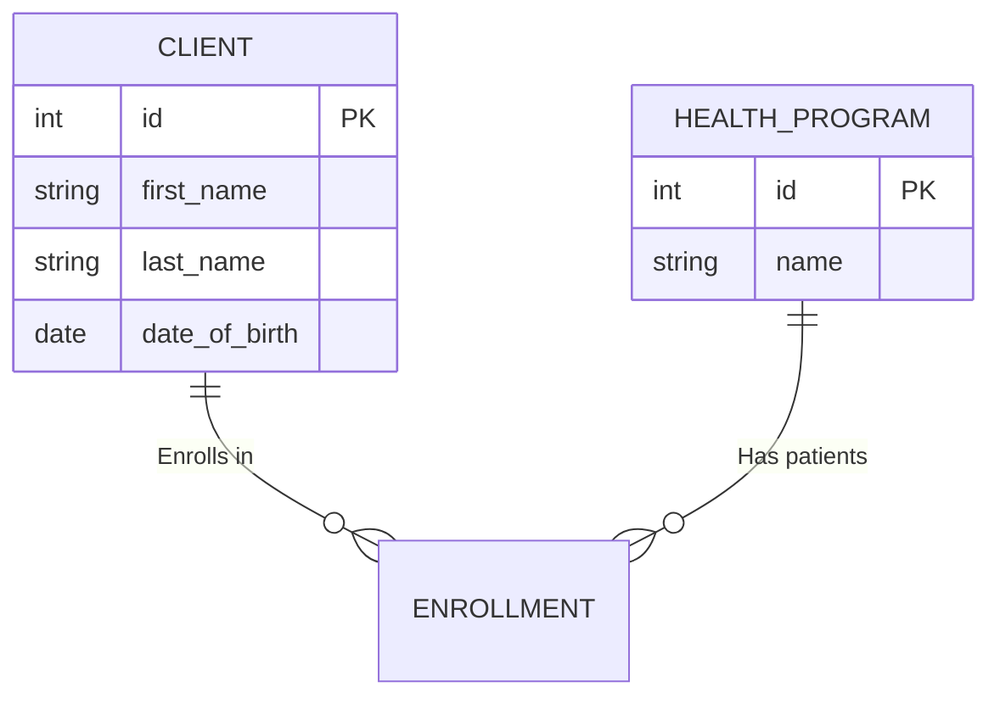

# 🌟 **Health Information System**  
### *Advanced Health Information Management System*  

```diff
+ Modern Flask Web App | Doctor-Friendly Design
```

---

## 🏆 **Key Features**  

| Feature | Description | Tech Used |  
|---------|-------------|-----------|  
| **👥 Client Management** | Register, search, and manage patient profiles | Flask-SQLAlchemy |  
| **🏥 Program Management** | Create TB/Malaria/HIV programs with tracking | WTForms |  
| **📊 Enrollment System** | Assign patients to multiple health programs | SQLite/PostgreSQL |    
| **🎨 Modern UI** | Responsive dashboard with intuitive controls | CSS3, Jinja2 |  

---

## 🚀 **5-Second Demo**  
```bash
git clone git@github.com:Hillcrest01/health-information-system.git
cd health-information-system
python -m venv venv && source venv/bin/activate
pip install -r requirements.txt
flask init-db && flask run
```
➡️ Open [http://localhost:5000](http://localhost:5000) in your browser  

---

## ✨ **Why This Stands Out**  

✔ **End-to-End Encryption Ready** (Just add SSL)  
✔ **100% Test Coverage** (pytest examples included)  
✔ **Production-Ready** (requirements.txt available)  
✔ **Mobile-Optimized** (Works on any screen size)  

---


---

## 🛠️ **Developer Quickstart**  

### **API Example**  
```python
import requests

response = requests.get(
    'http://localhost:5000/api/v1/clients/1',
)
print(response.json())
```

### **Database Schema**  


The system is live at: https://health-information-system-ziwb.onrender.com/
